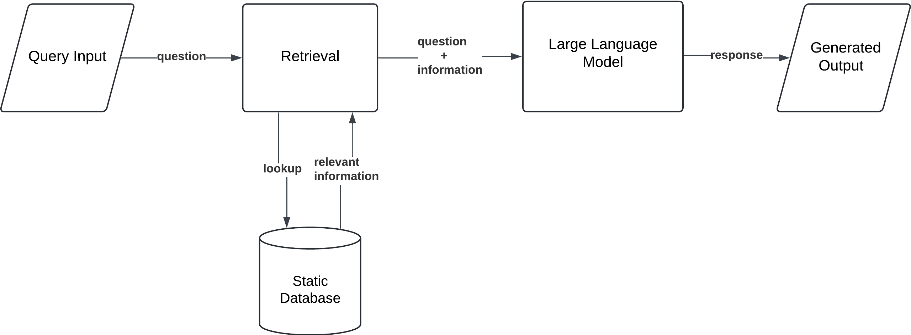

# Retrieval-Augmented Generation (RAG) on Large Langurage Model (LLM)

This repository demonstrates how to build a **Retrieval-Augmented Generation (RAG)** system, combining information retrieved from PDFs with generative large language model. This is ideal for building QA systems, knowledge assistants, and context-aware chatbots.

##  Overview

The pipeline includes the following components:

1. **Document Loading**: Load raw documents from a local directory.
2. **Text Splitting**: Break documents into smaller chunks for processing.
3. **Embedding Generation**: Convert text chunks into dense vector embeddings using OpenAI GPT-3.5 model API.
4. **Vector Indexing**: Store and search embeddings using llama_index.
5. **Retriever Setup**: Configure a retriever for semantic similarity search.

## Tech Stack

| Component           | Library/Tool          |
|--------------------|-----------------------|
| Large Langurage Model                | OpenAI GPT-3.5        |
| Embeddings         | OpenAI API            |
| Document Parsing   | SimpleDirectoryReader |
| Vector Store       | LlamaIndex            |
| Text Splitting     | LlamaIndex TextSplitter |

## Example Use Cases

- Internal company knowledge base search
- Chatbot with proprietary documents
- Legal/financial/Pharmaceutical document Q&A
- FAQ assistant for customer support

## RAG Architechture

## Sample Output

**User Query:**  
> What is Cotard Delusion?

**Generated Answer after RAG:**  
> Cotard Delusion is a rare neuropsychiatric condition where the patient denies their own existence or
the existence of body parts. It is characterized by nihilistic delusions that can range from denial
of body parts to negation of self-existence.

&nbsp;

## Future Improvements
Here are some potential enhancements planned for future development:

- **Multi-format Document Support**  
  Add support for `.docx`, `.html`, and `.xlsx` files in addition to PDFs and TXT.

- **Open-Source LLM Integration**  
  Replace or supplement OpenAI API with open-source models like Mistral, LLaMA, or Mixtral.

- **UI Interface**  
  Build a Streamlit or Gradio app for interactive RAG demo.

- **Evaluation Framework**  
  Add metrics and test sets for evaluating retrieval accuracy and generation quality.
